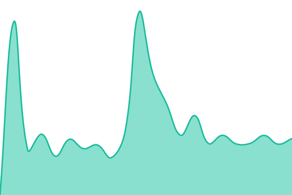
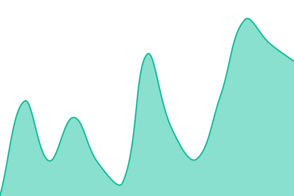
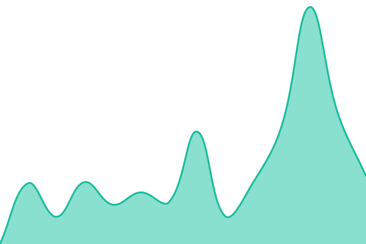
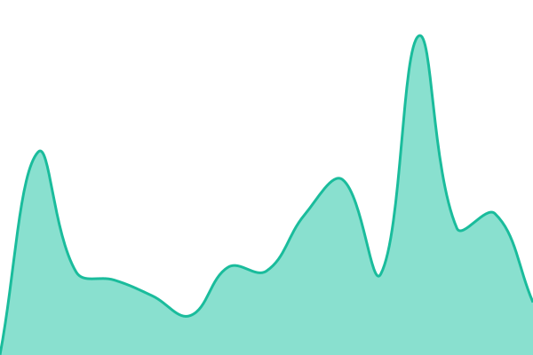
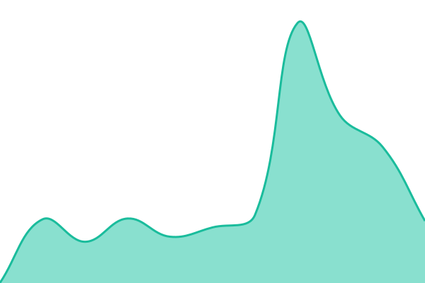
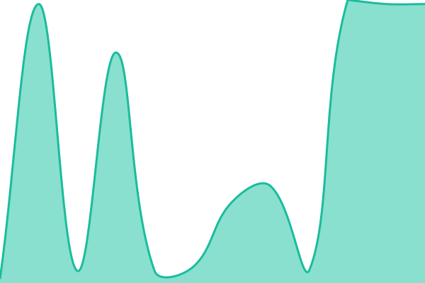
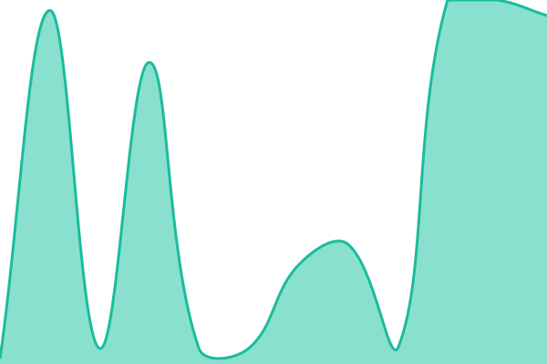

# [📈 Live Status](https://demo.upptime.js.org): <!--live status--> **🟩 All systems operational**

This repository contains the open-source uptime monitor and status page for [Patrick O'Brien](patrick.omg.lol), powered by [Upptime](https://github.com/upptime/upptime).

With [Upptime](https://upptime.js.org), you can get your own unlimited and free uptime monitor and status page, powered entirely by a GitHub repository. We use [Issues](https://github.com/obrienafc/status/issues) as incident reports, [Actions](https://github.com/obrienafc/status/actions) as uptime monitors, and [Pages](https://demo.upptime.js.org) for the status page.

<!--start: status pages-->
<!-- This summary is generated by Upptime (https://github.com/upptime/upptime) -->
<!-- Do not edit this manually, your changes will be overwritten -->
<!-- prettier-ignore -->
| URL | Status | History | Response Time | Uptime |
| --- | ------ | ------- | ------------- | ------ |
|  [Open WebUI](https://chat.patrickob.tech) | 🟩 Up | [open-web-ui.yml](https://github.com/obrienafc/status/commits/HEAD/history/open-web-ui.yml) | 

 646ms
     
 | 

<a href="https://status.patrickob.tech/history/open-web-ui">100.00%</a>
    

|  [DomainsLocker](https://domains.patrickob.tech) | 🟩 Up | [domains-locker.yml](https://github.com/obrienafc/status/commits/HEAD/history/domains-locker.yml) | 

 781ms
     
 | 

<a href="https://status.patrickob.tech/history/domains-locker">100.00%</a>
    

|  [PDF Tools](https://pdf.patrickob.tech) | 🟩 Up | [pdf-tools.yml](https://github.com/obrienafc/status/commits/HEAD/history/pdf-tools.yml) | 

 472ms
     
 | 

<a href="https://status.patrickob.tech/history/pdf-tools">100.00%</a>
    

|  [Memoes](https://notes.patrickob.me) | 🟩 Up | [memoes.yml](https://github.com/obrienafc/status/commits/HEAD/history/memoes.yml) | 

 386ms
     
 | 

<a href="https://status.patrickob.tech/history/memoes">100.00%</a>
    

|  [CS Phonetic](https://csphonetic.patrickob.me) | 🟩 Up | [cs-phonetic.yml](https://github.com/obrienafc/status/commits/HEAD/history/cs-phonetic.yml) | 

 463ms
     
 | 

<a href="https://status.patrickob.tech/history/cs-phonetic">100.00%</a>
    

|  [PLI SC Validator](https://pligamevalidator.patrickob.me) | 🟩 Up | [pli-sc-validator.yml](https://github.com/obrienafc/status/commits/HEAD/history/pli-sc-validator.yml) | 

 280ms
     
 | 

<a href="https://status.patrickob.tech/history/pli-sc-validator">100.00%</a>
    

|  [Purelymail IMAP](imap.purelymail.com) | 🟩 Up | [purelymail-imap.yml](https://github.com/obrienafc/status/commits/HEAD/history/purelymail-imap.yml) | 

 26ms
     
 | 

<a href="https://status.patrickob.tech/history/purelymail-imap">100.00%</a>
    

|  [Purelymail SMTP](smtp.purelymail.com) | 🟩 Up | [purelymail-smtp.yml](https://github.com/obrienafc/status/commits/HEAD/history/purelymail-smtp.yml) | 

 26ms
     
 | 

<a href="https://status.patrickob.tech/history/purelymail-smtp">100.00%</a>
    

|  [Purelymail POP3](pop3.purelymail.com) | 🟩 Up | [purelymail-pop-3.yml](https://github.com/obrienafc/status/commits/HEAD/history/purelymail-pop-3.yml) | 

 26ms
     
 | 

<a href="https://status.patrickob.tech/history/purelymail-pop-3">100.00%</a>
    

<!--end: status pages-->

[**Visit our status website →**](https://demo.upptime.js.org)

## 📄 License

- Powered by: [Upptime](https://github.com/upptime/upptime)
- Code: [MIT](./LICENSE) © [Anand Chowdhary](https://anandchowdhary.com)
- Data in the `./history` directory: [Open Database License](https://opendatacommons.org/licenses/odbl/1-0/)
